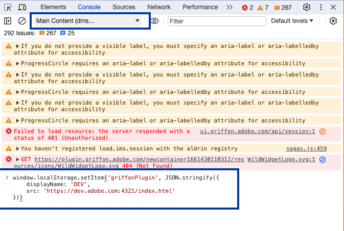
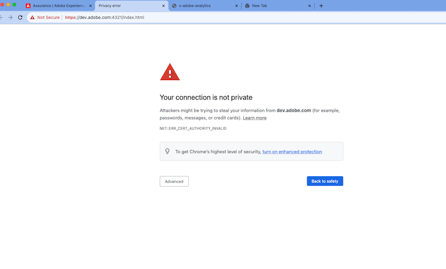
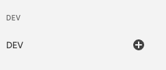

# Getting Started

## Prerequisites

To begin development of assurance plugins, begin by installing the following:

- Node 18+ (Recommended via [nvm](https://github.com/nvm-sh/nvm))
- [Yarn](https://yarnpkg.com/getting-started/install)

## Set up the repo

To allow nvm to install and use the correct version, begin by running

```bash
nvm install
nvm use
```

Then install all project dependencies by running

```bash
yarn
```

## Set up on Assurance

Begin by adding `dev.adobe.com` to point to `localhost` (/etc/hosts) by
executing this shell command.

```bash
echo "127.0.0.1 dev.adobe.com" | sudo tee -a /etc/hosts
```

Now, in Assurance, open the browser developer console and then select a session.
make sure to choose the Assurance context (it will likely be called
`Main Content` and is contained in the `top` context).

Now in the console input, you'll enter the following:

```javascript
window.localStorage.setItem(
  "griffonPlugin",
  JSON.stringify({
    displayName: "DEV",
    src: "https://dev.adobe.com:4321/index.html",
  }),
);
```



> **_NOTE:_** For the first time, you may need to bypass the secure connection
> with the https://dev.adobe.com:4321/index.html site for it to connect. In
> Chrome, click the `Advanced` button and choose to proceed to the domain.



The last step will be to add the plugin to your session in the Assurance UI. In
the left panel click the `Configure` button and then add the Dev plugin.

