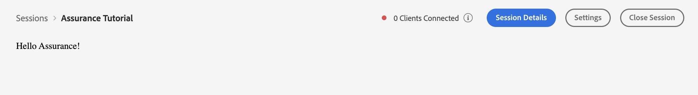
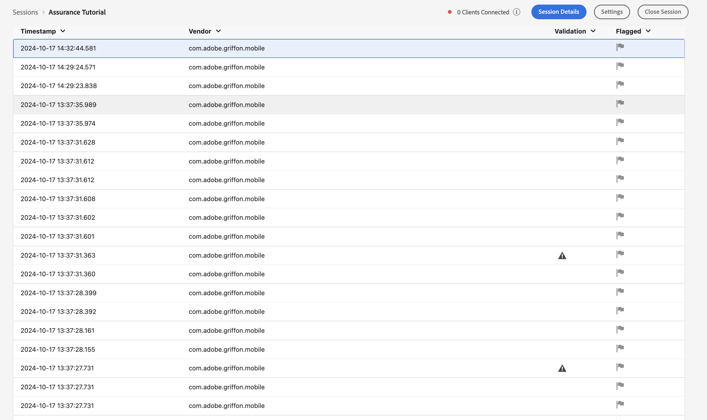
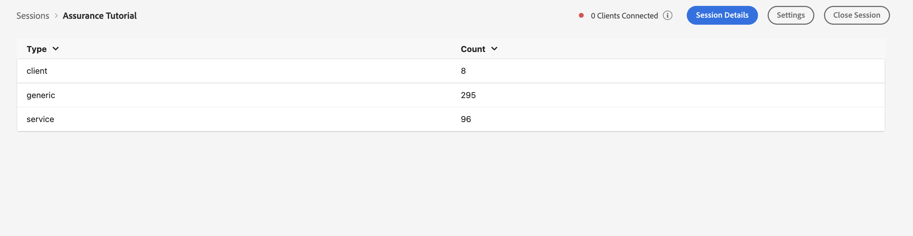

# Writing Your First Assurance Plugin

This tutorial will walk you through writing your first Assurance Plugin from
start to finish. Before starting this tutorial, make sure you have followed the
steps in the [Getting Started](../getting-started/) section of the
documentation. Once that is complete, you're ready to start!

The code for the tutorial app is contained inside
`packages/ui-plugins/tutorial-plugin`, which contains both the starting point as
well as the completed plugin you'll have by the end of the tutorial. Feel free
to use the `complete` folder as reference in case you get stuck!

## Running the Plugin

To begin the tutorial app, begin by running the following command at the root of
the repository

```bash
npx nx start @assurance/ui-plugin-tutorial
```

or by navigating to the plugin directory and running start via

```bash
cd packages/ui-plugins/tutorial-plugin
yarn start
```

If everything has gone correctly, you should see the following UI load inside
Assurance:



## Setting up the Providers

`Providers` are a type of React component that _provide_ context to any
component wrapped inside of them. When it comes to Assurance, there are
typically two providers we care about:

- `PluginBridgeProvider` - This component connects the plugin to the
  [Plugin Bridge](../basics/) which is allows your app access to the Assurance
  session data.

- React Spectrum's `Provider` - Gives your components context about React
  Spectrum's components styling

Let's begin by adding those two plugins to our UI plugin inside
`start/src/App.tsx`

```tsx
import { Provider, defaultTheme } from "@adobe/react-spectrum";
import { PluginBridgeProvider } from "@assurance/plugin-bridge-provider";
import React from "react";

// App.tsx
function App() {
  return (
    <Provider theme={defaultTheme} colorScheme="light">
      <PluginBridgeProvider>
        <div>Hello Assurance!</div>
      </PluginBridgeProvider>
    </Provider>
  );
}
```

## Creating a Simple Event List

Let's design one of the most basic Assurance plugins possible: an event list of
events in our session. To do so, we will use two key pieces:

1. The [useEvents](../apis/index.mdx#useevents) hook, which will give us the
   event data we want to display
2. The `EventTable` component, which will allow us to display the data

Since our hook call must be inside the `PluginBridgeProvider` component, let's
create a new component inside a new file and import our pieces:

```tsx
// src/components/events.tsx
import {
  EventTable,
  flaggedColumn,
  timestampColumn,
  validationColumn,
  vendorColumn,
} from "@assurance/event-table";
import { useEvents } from "@assurance/plugin-bridge-provider";
import React from "react";

function Events() {
  const events = useEvents(); // Returns all events currently in the session

  return (
    <EventTable
      columns={[timestampColumn, vendorColumn, validationColumn, flaggedColumn]}
      data={events}
    />
  );
}

export default Events;
```

Now let's update our app component to display our table:

```tsx
// App.tsx
...
import Events from './events'

function App() {
  return (
    <Provider theme={defaultTheme} colorScheme="light">
      <PluginBridgeProvider>
        <Events />
      </PluginBridgeProvider>
    </Provider>
  );
}
```

By doing so, we should see the following UI after a page reload:




Now we have all our events displayed inside a basic table! Let's make a small
change and filter the events to just edge events that are in our

## Creating a Grouped Event List

We've started with the basic event data flow, now its time to get a little more
complex! Our aim will be to display a new table that shows each event type
grouped by how many times that event occured.

We'll begin by grouping the data we get from `useEvents` by category inside of a
new hook

```tsx
// src/hooks/use-grouped-events.tsx

function useGroupedEvents() {
  const events = useEvents();
  const types = Array.from(new Set(events.map((event) => event.type))); // Grabs all unique event types
  const grouped = types.map((type) => {
    const typeEvents = events.filter((event) => event.type === type); // Filters events for given type
    return { type, events: typeEvents };
  });

  return grouped; // Returns an array of objects with the shape {type: string; events: Event[]}
}

export default useGroupedEvents;
```

Next, lets create some column defintions for an EventTable that will display
this data

```tsx
// src/components/grouped-event-table.tsx
const typeColumn: ColumnDef = {
  accessorKey: "type", // Will use the "type" field of the data we created above
  header: "Type", // The column header text that will be rendered
};

const countColumn: ColumnDef = {
  accessorKey: "events", // Will use the "type" field of the data we created above
  header: "Count", // The column header text that will be rendered
  cell: (props) => props.getValue().length, // getValue() will return the value specified in the acessor key, and we can read out the count of that list
};
```

Now let's bring it all together and display that data!

```tsx
// src/components/grouped-events.tsx
import { EventTable } from "@assurance/event-table";
import React from "react";
import useGroupedEvents from "../hooks/use-grouped-events.tsx";

function GroupedEvents() {
  const events = useGroupedEvents(); // Returns our grouped data list

  return <EventTable columns={[typeColumn, countColumn]} data={events} />;
}

export default GroupedEvents;
```

Once again, let's update our `App` component:

```tsx
// App.tsx
...
import GroupedEvents from './grouped-events'

function App() {
  return (
    <Provider theme={defaultTheme} colorScheme="light">
      <PluginBridgeProvider>
        <GroupedEvents />
      </PluginBridgeProvider>
    </Provider>
  );
}
```

Now we should see our Event Table filled with the data we grouped up! 




## Going Further

Now that you have displayed and manipulated data inside Assurance, you can keep
iterating on this example with any idea you have. Want to show an extra piece of
data? Add a new `ColumnDef` with the logic and add it in! Want to combine events
in a different way? See [Linking Events](../basics/events.mdx#linking-events)
and write your own logic for the events you care about.

Good luck and happy coding!
